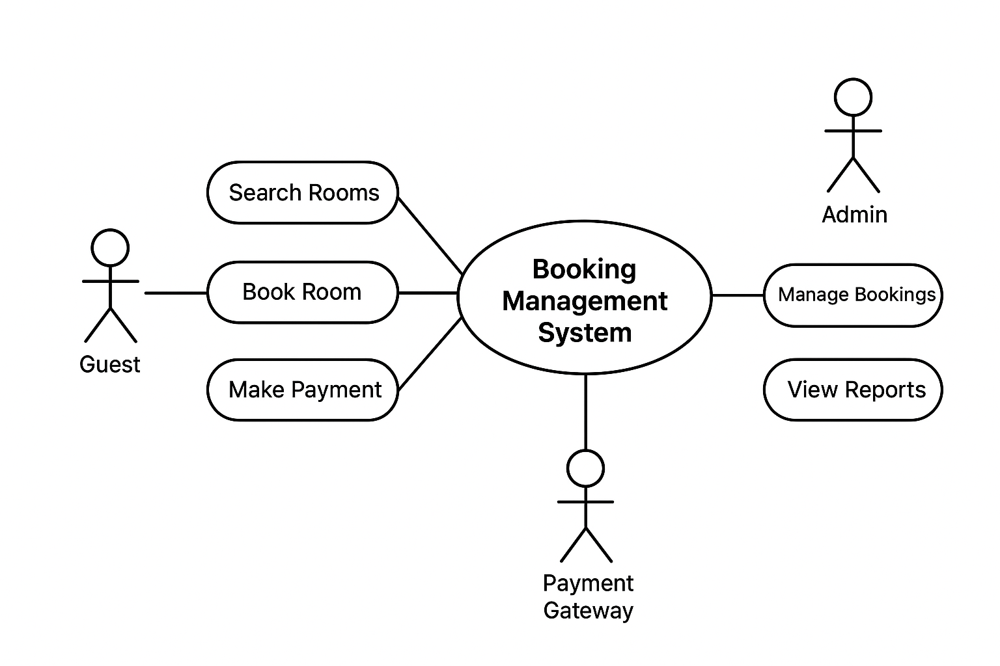

# Requirement Analysis in Software Development

This repository explores the **Requirement Analysis phase** in the Software Development Life Cycle (SDLC).  
It is developed as part of the **ALX FeatureForge Project**, focusing on designing a clear and structured foundation for a **Booking Management System**.

Through this project, I aim to demonstrate how to:

- Gather, document, and analyze requirements.
- Differentiate between functional and non-functional requirements.
- Create use case diagrams.
- Define clear acceptance criteria for system features.

---

## What is Requirement Analysis?

**Requirement Analysis** is the process of identifying, documenting, and managing the needs and expectations of stakeholders for a software project.  
It ensures that the development team fully understands what the system must achieve before implementation begins.

It is one of the most critical stages of the **Software Development Life Cycle (SDLC)** as it forms the foundation for design, development, and testing.

Key objectives include:

- Understanding user needs and business goals.
- Translating these needs into functional specifications.
- Defining system boundaries and constraints.
- Ensuring alignment between stakeholders and the development team.

---

## Why is Requirement Analysis Important?

Requirement Analysis is essential in ensuring project success.  
Here are three key reasons why it matters:

1. **Clarity and Alignment:**  
   It bridges the communication gap between stakeholders and developers by translating vague ideas into actionable requirements.

2. **Reduced Project Risks:**  
   Clear requirements minimize misunderstandings, rework, and project delays.

3. **Better Resource Planning:**  
   Knowing what is required allows for accurate time, cost, and manpower estimations.

4. **Improved Quality and User Satisfaction:**  
   When software meets exact user expectations, it enhances satisfaction and trust.

---

## Key Activities in Requirement Analysis

The Requirement Analysis process involves several structured activities:

- **Requirement Gathering:**  
  Collecting information from stakeholders through interviews, surveys, and observations.

- **Requirement Elicitation:**  
  Interpreting and understanding the gathered data to uncover real user needs.

- **Requirement Documentation:**  
  Clearly recording the requirements in structured documents or user stories.

- **Requirement Analysis and Modeling:**  
  Analyzing the relationships, dependencies, and feasibility of requirements; often represented through models or diagrams.

- **Requirement Validation:**  
  Reviewing requirements with stakeholders to confirm accuracy, completeness, and feasibility.

---

## Types of Requirements

Requirements are generally classified into two categories: **Functional** and **Non-functional Requirements.**

### Functional Requirements

These define _what_ the system should do.

Examples for the Booking Management System:

- Users can **search and view available rooms** based on date and location.
- Users can **book a room** and receive confirmation via email.
- Admins can **add, edit, or delete** rooms and booking details.
- The system should **generate booking reports** for management.

### Non-functional Requirements

These describe _how_ the system performs its functions.

Examples:

- **Performance:** The system should load pages within 2 seconds.
- **Security:** All user passwords must be encrypted using modern hashing algorithms.
- **Scalability:** The system should handle at least 10,000 concurrent bookings.
- **Availability:** The system must maintain 99.9% uptime.
- **Usability:** The interface must be mobile-responsive and intuitive.

---

## Use Case Diagrams

Use Case Diagrams visually represent how users (actors) interact with the system.

They help in:

- Understanding user-system relationships.
- Identifying core functionalities.
- Communicating requirements clearly to both business and technical teams.

Below is the use case diagram for the **Booking Management System**:

## 

## Acceptance Criteria

**Acceptance Criteria** define the conditions that a software feature must meet to be accepted by the product owner or client.

They serve as:

- A guide for developers to know when a feature is “done.”
- A testing benchmark for QA teams.
- A way to ensure user and business expectations are met.

### Example: Checkout Feature

**Feature:** Booking Checkout and Payment

**Acceptance Criteria:**

1. The user must be able to view a booking summary before payment.
2. The system should integrate securely with a payment gateway (e.g., Paystack).
3. A successful transaction should generate a confirmation email within 2 minutes.
4. In case of payment failure, the user should receive an appropriate error message.
5. The booking record should be updated in real-time in the system database.

---
